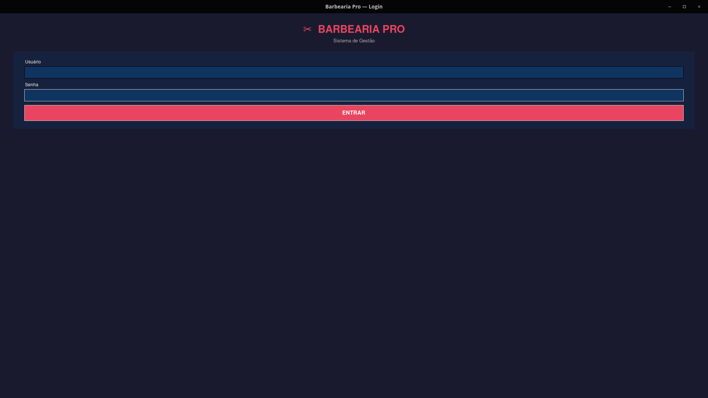
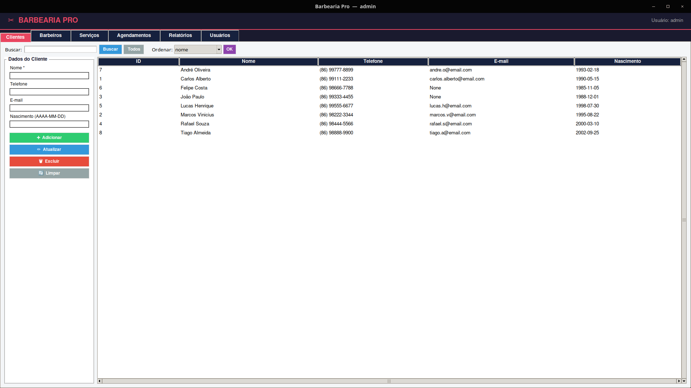
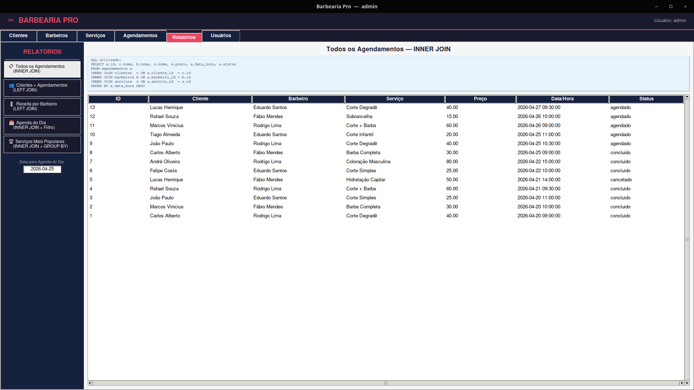

# ✂ Barbearia Pro — Sistema de Gestão

> Trabalho Acadêmico — Banco de Dados | UNIFSA | Professor Anderson Costa

Sistema completo de gestão para barbearia com interface gráfica, desenvolvido em **Python + Tkinter** integrado ao **PostgreSQL**.

---

## Descrição do Tema

O sistema gerencia o fluxo diário de uma barbearia: cadastro de **clientes**, **barbeiros** e **serviços**, com controle de **agendamentos** e geração de **relatórios**. O acesso é protegido por tela de login com senha criptografada (SHA-256).

---

## Tecnologias Utilizadas

| Camada | Tecnologia |
|--------|-----------|
| Linguagem | Python 3.10+ |
| Interface | Tkinter (GUI nativa do Python) |
| Banco de Dados | PostgreSQL 14+ |
| Driver de conexão | psycopg2 |
| Segurança | hashlib — SHA-256 |

---

## Estrutura do Banco de Dados

```
usuarios     ← autenticação
clientes     ← PK: id
barbeiros    ← PK: id
servicos     ← PK: id
agendamentos ← PK: id | FK: cliente_id, barbeiro_id, servico_id
```

As 5 tabelas estão relacionadas com **Chaves Primárias (PK)** e **Chaves Estrangeiras (FK)** com integridade referencial.

---

## Funcionalidades

- **Login** com autenticação por username + senha (SHA-256)
- **CRUD completo** para Clientes, Barbeiros, Serviços e Agendamentos
- **Filtros** por nome, status, data
- **Ordenação** por múltiplos campos
- **Relatórios** com `INNER JOIN` e `LEFT JOIN`:
  - Todos os agendamentos com detalhes (3× INNER JOIN)
  - Clientes e total de agendamentos (LEFT JOIN — inclui quem nunca agendou)
  - Receita por barbeiro (LEFT JOIN)
  - Agenda do dia por data (INNER JOIN + filtro)
  - Serviços mais populares (INNER JOIN + GROUP BY)

---

## Estrutura de Pastas

```
barbearia-bd/
├── diagrama/        # DER — Diagrama Entidade-Relacionamento
├── ddl/
│   └── schema.sql   # Criação das tabelas (DDL)
├── dml/
│   └── dados.sql    # Inserções, atualizações e deleções de exemplo
├── dql/
│   └── consultas.sql # Consultas com JOINs, filtros e ordenação
├── src/
│   └── app.py       # Código-fonte da aplicação Python + Tkinter
└── README.md
```

---

## Prints da Aplicação

| Tela | Descrição |
|------|-----------|
|  | Tela de login |
|  | Menu principal (abas) |
|  | Resultado com JOIN |

---

## Instruções de Execução

### Pré-requisitos

```bash
# Python 3.10+
python3 --version

# Instalar psycopg2
pip install psycopg2-binary
```

### 1. Configurar o PostgreSQL

```bash
# Criar o banco
psql -U postgres -c "CREATE DATABASE barbearia;"

# Criar as tabelas (DDL)
psql -U postgres -d barbearia -f ddl/schema.sql

# Inserir dados de exemplo (DML)
psql -U postgres -d barbearia -f dml/dados.sql
```

### 2. Ajustar a conexão no app.py (se necessário)

Abra `src/app.py` e edite o dicionário `DB` no topo:

```python
DB = {
    "host":     "localhost",
    "database": "barbearia",
    "user":     "postgres",
    "password": "postgres",   # <-- altere para sua senha
    "port":     "5432",
}
```

### 3. Executar a aplicação

```bash
cd src
python3 app.py
```

### 4. Credenciais de acesso

| Usuário | Senha | Nível |
|---------|-------|-------|
| `admin` | `admin123` | Administrador |
| `operador` | `op1234` | Operador |

---

## Senhas SHA-256 (para referência)

Para gerar o hash de uma nova senha:

```python
import hashlib
print(hashlib.sha256(b"minha_senha").hexdigest())
```

Após gerar, faça um `UPDATE` na tabela `usuarios`.

---

## Link do Vídeo

https://drive.google.com/file/d/1LvzSNOP3Q6Ftc6gjGoiD_WODkBDvRL-N/view?usp=drive_link
---

## Autor

**Késsedy Rodrigues Araujo**  
Disciplina: Banco de Dados — UNIFSA  
Professor: Anderson Costa
