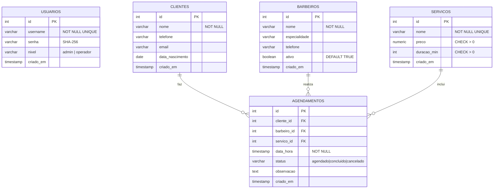

# Diagrama Entidade-Relacionamento — Barbearia Pro
# Cole o código abaixo em: https://mermaid.live  → clique em "Download PNG"

```mermaid
erDiagram
    USUARIOS {
        int      id         PK
        varchar  username   "NOT NULL UNIQUE"
        varchar  senha      "SHA-256"
        varchar  nivel      "admin | operador"
        timestamp criado_em
    }

    CLIENTES {
        int      id              PK
        varchar  nome            "NOT NULL"
        varchar  telefone
        varchar  email
        date     data_nascimento
        timestamp criado_em
    }

    BARBEIROS {
        int      id            PK
        varchar  nome          "NOT NULL"
        varchar  especialidade
        varchar  telefone
        boolean  ativo         "DEFAULT TRUE"
        timestamp criado_em
    }

    SERVICOS {
        int      id          PK
        varchar  nome        "NOT NULL UNIQUE"
        numeric  preco       "CHECK > 0"
        int      duracao_min "CHECK > 0"
        timestamp criado_em
    }

    AGENDAMENTOS {
        int       id          PK
        int       cliente_id  FK
        int       barbeiro_id FK
        int       servico_id  FK
        timestamp data_hora   "NOT NULL"
        varchar   status      "agendado|concluido|cancelado"
        text      observacao
        timestamp criado_em
    }

    CLIENTES  ||--o{ AGENDAMENTOS : "faz"
    BARBEIROS ||--o{ AGENDAMENTOS : "realiza"
    SERVICOS  ||--o{ AGENDAMENTOS : "inclui"
```
